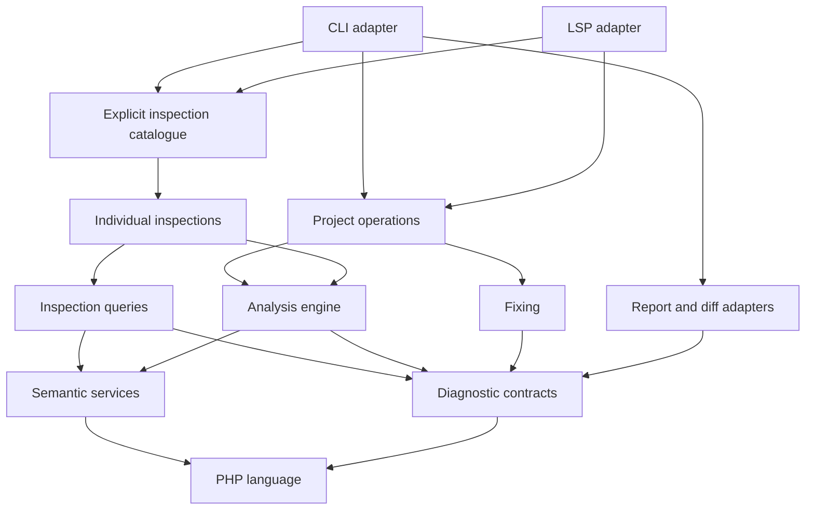

# Architecture

Custos is one Go module with standard-library runtime dependencies. Feature
roots separate language processing, semantics, inspections, project operations
and adapters. `cmd/custos` only passes process arguments and streams to the CLI.

## Ownership

| Root | Responsibilities |
|---|---|
| `internal/php` | `syntax`: lexer, parser, arena AST, traversal and positions; `version`: PHP 5.3–8.5; `phpdoc`: doc tags and type expressions. |
| `internal/semantic` | `names`, `types`, `index`, `infer` and embedded `stubs`: resolution, declarations, inheritance, inference and narrowing. |
| `internal/inspection` | `analysis`: dispatch, context and suppressions; `meta`: independent rule facts and descriptions; `catalogue`: explicit constructors; `rules`: one package per lowercase inspection ID. |
| `internal/inspection/astquery` | Lexical queries over nodes and tokens, plus exact source-edit builders. Written names do not imply resolved symbols. |
| `internal/inspection/flowquery` | Local reachability, assignments, side effects and possible values. |
| `internal/inspection/semanticquery` | Resolved calls, classes, hierarchies, types and inspection fix decisions. |
| `internal/inspection/phpunit` | Shared assertion-call shapes, method spelling and PHPUnit version detection. |
| `internal/diagnostic` | Severity, findings, lazy fixes, edits, file results and positioned items. |
| `internal/fixing` | Conflict detection, edit application and bounded iterative fixing. |
| `internal/project` | Discovery, bounded reading, indexing, buffer analysis, project reporting and prepared file fixes; `config` and `baseline` subpackages. |
| `internal/output` | `report` renders text, JSON, Checkstyle, GitHub and SARIF; `diff` renders changes. |
| `internal/cli` | Arguments, configuration precedence, profiling, output, exit codes and file writes. |
| `internal/editor/lsp` | Transport dispatch, settings, workspace indexing, documents, diagnostics and code actions. |
| `internal/platform/safeio` | Bounded filesystem primitives. |
| `internal/testing` | Conformance harness and load-scaled test budgets. |
| `tools` | Generators, architecture enforcement, coverage and clean-room checks. |

## Execution and contracts

`project.Open` receives resolved options and an explicit inspection list. It
builds an engine and discovers PHP files plus enabled inspections' file patterns.
`AnalyzeReport` indexes project and vendor declarations when needed, reuses
source bytes and removes edit closures while retaining fix titles.
`PrepareFixes` computes deterministic outcomes without writing files. CLI owns
diffs, writes and exit decisions. `AnalyzeBuffer` processes supplied editor
bytes without filesystem reads.

Each inspection exposes `New() analysis.Rule`; implementation types and private
helpers stay in its package. `catalogue.All` constructs inspections in the
original group order, sorted by ID within each group. Categories are metadata.
The engine subscribes inspections by node kind and walks each parsed file once.
Names, symbols, types and memoized queries are lazy per-file context data.

`Engine.WithIndex` returns a configured copy. Published engines are never
reconfigured in place. LSP publishes replacement engines while holding its
workspace mutex. Source positions remain `uint32` byte offsets; diagnostic
items use rune columns and LSP uses UTF-16 columns.

A `diagnostic.Fix` builds exact edits lazily. Fixing depends on an `Analyzer`
interface returning findings for a parsed file. It selects one fix per finding,
keeps multi-edit fixes together, rejects ambiguous insertion conflicts and
iterates at most ten times. Single-pass mode preserves editor/conformance
semantics. Rule implementations decide whether a proposed fix is safe.

## Semantic evidence and fix safety

A written name is not enough to identify a builtin. Use the analysis context's
resolved global-function queries so namespace functions and imports retain
PHP's runtime behavior. Function, method and class names are case-insensitive;
variables, properties and ordinary constants are case-sensitive.

PHPDoc supplies useful analysis evidence, but it does not enforce runtime types.
When a fix requires native type evidence, use `Env.Native()` to exclude user
PHPDoc. Unsupported operations, escaped values and exhausted analysis budgets
must discard definite facts rather than authorize a finding or fix.

Project indexes are built in memory. The LSP builds its workspace index in the
background and publishes replacement engines under its workspace mutex. Keep
shared declarations immutable during context-dependent member lookup.

## Bounded analysis and input

Repository content and editor buffers are untrusted input. Preserve bounds on
source size, syntax nesting, findings, PHPDoc parsing and expansion, hierarchy
traversal and local-flow work. When adding a traversal, account for cycles and
repeated queries as well as recursion depth; cache reusable scope queries and
fall back conservatively when a budget is exhausted.

Filesystem reads belong to bounded `safeio` operations, which require regular
files and check the opened descriptor as well as the path. Adapters retain
responsibility for writes, path validation and protocol framing. Malformed or
oversized input must produce a controlled error rather than hang or panic.

Use hostile-input regression tests and fuzz targets for these contracts.
Measure hot-path changes with `make bench` and allocation counts; retain local
corpus comparisons and timing logs in ignored `.cache/`, not in documentation.

## Dependency enforcement

`make architecture`, included in `make verify`, checks production imports,
forbids cross-inspection dependencies and validates catalogue completeness,
unique registration, lowercase ID directories, constructors, specs and fixtures.
PHP, semantic, diagnostic, analysis and fixing packages cannot depend on CLI,
LSP, reporting, project orchestration or filesystem adapters. Test imports may
cross boundaries to exercise complete execution paths.

Keep a helper in its inspection until another inspection needs it. Then choose
its owner by behavior: lexical AST, local flow or resolved semantics. Preserve
the difference between a written call name and its actual runtime target,
especially when deciding whether a fix is safe.

## Extending features

- Add an inspection in its ID package, with spec and fixtures at their stable
  locations; add one constructor to the catalogue. Follow the clean-room process.
- Improve inference in `semantic/infer`, with tests there. Environment,
  expressions, operators, calls, members, variables, conditions, guards and
  invalidation have separate files in the same package and share existing caches.
- Add a fix to its inspection using diagnostic edits. Generic conflict/application
  changes belong in `fixing`; project preparation and adapter writes stay separate.
- Add an output adapter in `output/report` using positioned diagnostic items.
  Core analysis and baselines do not depend on reporting.
- Extend syntax in `php/syntax`, then regenerate node kinds and verify all PHP
  versions. Keep arena ownership, parser recovery and exact spans intact.

## Generated files

`make rules-doc` regenerates `inspection/meta/descriptions.json`, the public
rule reference, sidebar and internal status table. `make stubs` rebuilds embedded
semantic assets. Specifications and inspection fixtures remain ID-based.
